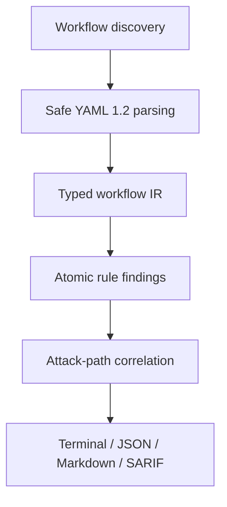
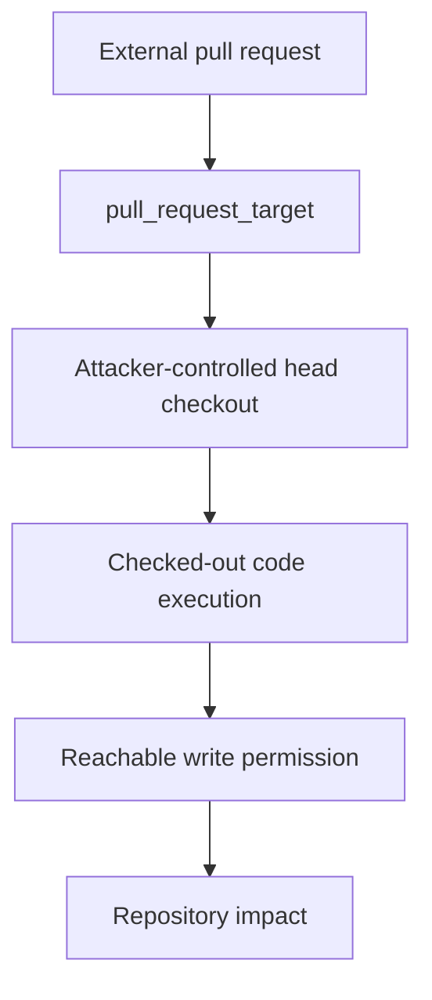

<div align="center">


# GHA-ThreatLens

**Offline static analysis and explainable attack-path correlation for GitHub Actions.**

GHA-ThreatLens connects workflow triggers, attacker-controlled inputs, code execution and reachable permissions into evidence-backed paths.

[](https://github.com/yusufdalbudak/gha-threatlens/releases/tag/v0.1.0)
[](https://github.com/yusufdalbudak/gha-threatlens/actions/workflows/ci.yml)
[](#verification-and-release-gates)
[](LICENSE)
[](#output-formats)
[](#trust-and-privacy-model)

[Quick start](#quick-start) ·
[How it works](#how-it-works) ·
[Rules](#supported-rules) ·
[Risk model](#risk-and-confidence) ·
[CI integration](#ci-integration) ·
[Trust model](#trust-and-privacy-model) ·
[Documentation](#documentation)

</div>

---

GitHub Actions workflows are executable security boundaries. They can ingest untrusted input, run repository or pull-request code, and hold a `GITHUB_TOKEN` with repository privileges. Isolated YAML warnings do not always show whether those conditions form an exploitable route.

GHA-ThreatLens is a local, deterministic CLI. It records atomic security facts from workflow YAML and correlates them only when the required attack-path edges exist. If an essential edge is missing, it does not invent a complete path.

Workflow content is never executed. Local scans require no GitHub token, network request or telemetry.

> [!IMPORTANT]
> **Release posture:** `v0.1.0` ships four focused rules and one correlated chain (`pull_request_target` → attacker-controlled checkout → execution). The 0–100 score is a prioritisation mechanism—not exploit probability and not CVSS. Static analysis cannot observe organisation, enterprise, fork or Dependabot permission defaults that are absent from local YAML.

---

## Why GHA-ThreatLens?

| Capability | What the scanner does |
|---|---|
| **Evidence-backed correlation** | Rules emit findings and facts. Correlation builds a path only when every required edge is present. |
| **Offline-first execution** | Local scans make no network requests and do not read GitHub tokens. |
| **Typed intermediate representation** | YAML is normalised into frozen workflow, job, step, trigger and permission objects. |
| **Explicit trust classification** | Events and selected `github.*` fields are classified as maintainer, collaborator, external, public, actor-dependent or unknown. |
| **Permission-aware reasoning** | `write-all`, explicit scopes, `{}` and missing keys are modelled separately. Missing `permissions` stays unknown. |
| **Explainable scoring** | Each result includes a 0–100 breakdown across documented dimensions. |
| **Separate confidence** | HIGH, MEDIUM and LOW are reported independently of the numeric score. |
| **Deterministic output** | The same tree produces the same findings, fingerprints and reports. |
| **CI-friendly severity gates** | `--fail-on` maps scan results to documented exit codes. |
| **Multiple report formats** | One canonical `ScanResult` is rendered as terminal, JSON, Markdown or SARIF 2.1.0. |

Isolated checks can list a privileged trigger, a head checkout, a write permission and a local script as unrelated items. When those facts form a complete chain, GHA-ThreatLens emits one ordered path.

---

## Quick start

Install the `v0.1.0` wheel from the GitHub Release:

```bash
python3 -m venv .venv
.venv/bin/python -m pip install \
  https://github.com/yusufdalbudak/gha-threatlens/releases/download/v0.1.0/gha_threatlens-0.1.0-py3-none-any.whl

.venv/bin/gha-threatlens scan /path/to/repository
```

From a repository checkout:

```bash
git clone https://github.com/yusufdalbudak/gha-threatlens.git
cd gha-threatlens
python3 -m venv .venv
.venv/bin/python -m pip install -U pip
.venv/bin/python -m pip install .
.venv/bin/gha-threatlens scan examples/vulnerable --no-color
```

`PATH` defaults to the current directory. No GitHub token is required for local scans.

<details>
<summary><strong>Contributor installation</strong></summary>

Python 3.11, 3.12 or 3.13. Tests import the installed `gha_threatlens` package, not `src/` via `PYTHONPATH`.

```bash
python3 -m venv .venv
.venv/bin/python -m pip install -U pip
.venv/bin/python -m pip install -e ".[dev]"
```

See [CONTRIBUTING.md](CONTRIBUTING.md).

</details>

---

## See it in action

`examples/vulnerable` contains two workflows. A scan reports four findings and one attack path. The correlated path is scored **92** and banded **critical**:

```text
GHA-ThreatLens 0.1.0  files=2  findings=4  paths=1
informational=0  low=0  medium=1  high=2  critical=1
Score is a prioritisation aid, not an exploit probability.

PATH CRIT PATH-f0be112b3ce5c3e6 score=92 conf=high
  External pull request -> privileged pull_request_target workflow -> attacker-controlled head checkout -> checked-out code execution -> reachable token privilege.
  score exp 20 + expl 30 + priv 16 + imp 16 + chain 10 - mit 0 = 92

HIGH GHAT-003 .github/workflows/issue-echo.yml:9:9 score=78 conf=high
HIGH GHAT-002 .github/workflows/pr-target.yml:4:1 score=62 conf=high
MED GHAT-001 .github/workflows/pr-target.yml:10:9 score=68 conf=high
CRIT GHAT-004 .github/workflows/pr-target.yml:10:9 score=92 conf=high
```

The scanner does not stop at four unrelated warnings. It shows the evidence-backed route from an external pull request to privileged execution of checked-out code. GHAT-001 remains medium in this example because the job is classified as a test job; the numeric total is not the displayed band.

The hardened example produces no findings:

```text
GHA-ThreatLens 0.1.0  files=1  findings=0  paths=0
```

```bash
gha-threatlens scan examples/vulnerable --no-color
gha-threatlens scan examples/hardened --no-color
```

<details>
<summary><strong>View complete example output</strong></summary>

```text
GHA-ThreatLens 0.1.0  files=2  findings=4  paths=1
informational=0  low=0  medium=1  high=2  critical=1
Score is a prioritisation aid, not an exploit probability.

PATH CRIT PATH-f0be112b3ce5c3e6 score=92 conf=high
  External pull request -> privileged pull_request_target workflow -> attacker-controlled head checkout -> checked-out code execution -> reachable token privilege.
  > External or fork-controlled pull request
  > Privileged pull_request_target workflow
  > Attacker-controlled head checkout
  > Checked-out code execution
  > Reachable privilege or sensitive asset
  score exp 20 + expl 30 + priv 16 + imp 16 + chain 10 - mit 0 = 92
  remediation: Do not check out github.event.pull_request.head.sha (or equivalent) in a pull_request_target workflow that has write permissions or secrets. Prefer pull_request for untrusted tests, or run untrusted builds in an isolated workflow with permissions: {} and no secrets. If a privileged job must comment on a pull request, operate only on the trusted base checkout.

HIGH GHAT-003 .github/workflows/issue-echo.yml:9:9 score=78 conf=high
  Untrusted expression in command interpreter
  evidence: - run: echo "${{ github.event.issue.title }}"
  exp 20 + expl 30 + priv 8 + imp 10 + chain 10 - mit 0 = 78
  remediation: Do not interpolate untrusted ${{ }} expressions into run: source. Pass the value through env and handle it as data in the selected shell. Quoting inside the YAML does not prevent injection because GitHub expands expressions before the shell starts. Moving a value to env does not solve every case if the variable is later expanded unsafely. Pass the value through `env` and expand the environment variable as data. Prefer `printf %s "$VAR"` or quoted expansion; do not splice untrusted content into a Bash script with `${{ }}`. Environment assignment does not remove every injection case if the variable is later expanded unquoted.

HIGH GHAT-002 .github/workflows/pr-target.yml:4:1 score=62 conf=high
  Excessive token permissions
  evidence: permissions:
  exp 20 + expl 6 + priv 16 + imp 12 + chain 8 - mit 0 = 62
  remediation: Declare the minimum GITHUB_TOKEN scopes required, preferably at job level. Prefer contents: read unless the job must modify the repository. An absent permissions key is unknown, not confirmed write access. Legitimate publish jobs may need write scopes; the finding flags breadth, not business necessity.

MED GHAT-001 .github/workflows/pr-target.yml:10:9 score=68 conf=high
  Mutable action reference
  evidence: - uses: actions/checkout@v4
  exp 20 + expl 8 + priv 16 + imp 16 + chain 8 - mit 0 = 68
  remediation: Verify that the commit belongs to the intended upstream repository and corresponds to the expected release, then pin uses: to the full 40-character commit SHA. Do not substitute an unverified SHA for a tag. Local paths are ignored. Docker image tags are not Git refs; digest pinning is not analysed in v0.1.0.

CRIT GHAT-004 .github/workflows/pr-target.yml:10:9 score=92 conf=high
  Privileged execution of pull request code
  evidence: pull_request_target:
  exp 20 + expl 30 + priv 16 + imp 16 + chain 10 - mit 0 = 92
  remediation: Do not check out github.event.pull_request.head.sha (or equivalent) in a pull_request_target workflow that has write permissions or secrets. Prefer pull_request for untrusted tests, or run untrusted builds in an isolated workflow with permissions: {} and no secrets. If a privileged job must comment on a pull request, operate only on the trusted base checkout.
```

</details>

---

## How it works



| Stage | Responsibility |
|---|---|
| Discovery | Finds `.github/workflows/*.{yml,yaml}` within the resolved scan root. |
| Parser | Parses YAML 1.2 without executing workflow content or constructing objects from tags. |
| Normalisation | Produces a typed, deterministic representation of triggers, jobs, steps and permissions. |
| Rules | Emit findings and security facts. |
| Correlation | Builds a path only when required edges exist. |
| Reporters | Render one canonical `ScanResult` into supported formats. |

Discovery does not follow directory or file symlinks that resolve outside the scan root. Workflow files larger than 1 MiB are skipped with a diagnostic. `${{ }}` expressions are retained as data and are not expanded. Details: [docs/architecture.md](docs/architecture.md).

---

## Attack-path example

GHAT-004 is the correlated `pull_request_target` chain:



`pull_request_target` alone is not treated as a confirmed vulnerability. Correlation requires attacker-controlled checkout **and** subsequent execution in the same job. Reachable privilege affects scoring and narrative; a missing checkout or execution edge prevents a complete attack-path conclusion.

The same trigger with a trusted base checkout, or with a head checkout and no later execution of pull-request code, does not produce a confirmed GHAT-004 path.

---

## Supported rules

| Rule | Detects | Evidence requirement | Typical severity |
|---|---|---|---|
| **GHAT-001** | Mutable remote action and reusable-workflow Git refs | `uses:` is not a full 40-character commit SHA. Local paths are ignored. Docker tags are not treated as Git refs. | Medium |
| **GHAT-002** | Explicit excessive `GITHUB_TOKEN` permissions | `write-all` or a high-impact write scope declared in YAML. A missing `permissions` key is unknown, not confirmed write access. | Medium |
| **GHAT-003** | Untrusted expressions interpolated into a command interpreter | Untrusted `${{ }}` appears in `run:`. Values passed only through `env` are not this finding. | High |
| **GHAT-004** | Privileged pull-request code execution | `pull_request_target` plus attacker-controlled checkout plus subsequent execution. The trigger alone is not sufficient. | Critical |

Typical severity is the rule metadata default. Scoring and job-purpose guardrails can change the displayed band. A mutable action reference is not, by itself, a confirmed exploit.

```bash
gha-threatlens rules list
gha-threatlens explain GHAT-004
```

Adding a fifth rule is a deliberate product change. See [docs/rule-authoring.md](docs/rule-authoring.md).

---

## Risk and confidence

The score is a prioritisation mechanism—not exploit probability and not CVSS.

| Dimension | Range | Question |
|---|---|---|
| Exposure | 0–20 | Who can reach or trigger the path? |
| Exploitability | 0–30 | Does controlled input reach executable behaviour? |
| Reachable privilege | 0–20 | What token, secret, OIDC or runner privilege is in scope? |
| Potential impact | 0–20 | What can happen to the repository, package, release or deployment? |
| Chain evidence | 0–10 | How direct is the observed path? |
| Applicable mitigations | 0 to −20 | Which controls actually constrain this path? |

| Score | Severity |
|-----:|---|
| 0–19 | Informational |
| 20–39 | Low |
| 40–59 | Medium |
| 60–79 | High |
| 80–100 | Critical |

Confidence is separate:

| Level | Meaning |
|---|---|
| **HIGH** | Direct structural evidence from parsed YAML. |
| **MEDIUM** | One defensible heuristic. |
| **LOW** | Incomplete or naming-based evidence. |

Non-high results explain the uncertainty. See [docs/risk-model.md](docs/risk-model.md).

---

## Output formats

| Format | Primary use |
|---|---|
| Terminal | Local review and developer feedback |
| JSON | Automation and downstream processing |
| Markdown | Human-readable reports and pull-request artefacts |
| SARIF 2.1.0 | GitHub code scanning integration |

```bash
gha-threatlens scan . --format terminal --no-color
gha-threatlens scan . --format json --output findings.json
gha-threatlens scan . --format markdown --output findings.md
gha-threatlens scan . --format sarif --output findings.sarif
```

JSON, Markdown and SARIF written to stdout contain only the report. The scanner writes a SARIF file; it does not upload it to GitHub.

---

## CI integration

Least-privilege example. Third-party actions are pinned to verified full commit SHAs resolved from the tagged releases in the comments.

```yaml
name: gha-threatlens
on:
  pull_request:
  push:
    branches: [main]
permissions:
  contents: read
jobs:
  scan:
    runs-on: ubuntu-latest
    steps:
      - uses: actions/checkout@3d3c42e5aac5ba805825da76410c181273ba90b1 # v7.0.1
      - uses: actions/setup-python@5fda3b95a4ea91299a34e894583c3862153e4b97 # v7.0.0
        with:
          python-version: "3.13"
      - run: python -m pip install .
      - run: gha-threatlens scan . --fail-on high --no-color
```

GitHub may inject a repository-scoped `GITHUB_TOKEN` into the job. The scanner does not read that token. Local scanning does not require `security-events: write`.

<details>
<summary><strong>Optional SARIF upload</strong></summary>

Upload is a separate GitHub step. It requires `security-events: write`. SARIF display in private repositories depends on the GitHub plan and whether code scanning is enabled.

GHAT-002 reports explicit high-impact write scopes, including `security-events`. That finding flags breadth of token access; it does not prove the job is unnecessary.

```yaml
name: gha-threatlens-sarif
on:
  pull_request:
  push:
    branches: [main]
permissions:
  contents: read
  security-events: write
jobs:
  scan:
    runs-on: ubuntu-latest
    steps:
      - uses: actions/checkout@3d3c42e5aac5ba805825da76410c181273ba90b1 # v7.0.1
      - uses: actions/setup-python@5fda3b95a4ea91299a34e894583c3862153e4b97 # v7.0.0
        with:
          python-version: "3.13"
      - run: python -m pip install .
      - run: gha-threatlens scan . --format sarif --output results.sarif --no-color
      - uses: github/codeql-action/upload-sarif@f3712979fa5f215279b101dd0a2e3bdfb4353324 # v3.37.7
        with:
          sarif_file: results.sarif
```

</details>

---

## CLI reference

```text
gha-threatlens scan PATH
gha-threatlens rules list
gha-threatlens explain RULE_ID
gha-threatlens version
```

`scan` options:

| Option | Effect |
|---|---|
| `--format terminal\|json\|markdown\|sarif` | Report format. Default: `terminal`. |
| `--output FILE` | Write the report to a file instead of stdout. |
| `--fail-on informational\|low\|medium\|high\|critical` | Exit 1 when a finding or attack path meets this severity or higher. |
| `--min-severity informational\|low\|medium\|high\|critical` | Omit lower-severity results. Default: `informational`. |
| `--no-color` | Disable ANSI colour. Also honoured when stdout is not a TTY or `NO_COLOR` is set. |
| `--quiet` | Suppress the terminal summary; findings and paths are still printed. |

Exit codes:

| Code | Meaning |
|:--:|---|
| **0** | Scan completed; nothing met `--fail-on`, or no fail threshold was set. |
| **1** | Scan completed; at least one finding or attack path met `--fail-on`. |
| **2** | User input, target or parsing prevented a valid requested scan. |
| **3** | Unexpected internal error. |

<details>
<summary><strong>Scan behaviour notes</strong></summary>

- A malformed workflow is recorded as a diagnostic; other files in the same scan are still analysed.
- The default maximum workflow size is 1 MiB (`DEFAULT_MAX_WORKFLOW_BYTES`). Larger files are skipped with a diagnostic.
- `--fail-on` is evaluated after rendering. A completed scan can still exit 1.

</details>

---

## Trust and privacy model

| Surface | Behaviour |
|---|---|
| Workflow execution | Never executed. Shell is not evaluated. `${{ }}` is not expanded. |
| Network access | None during local scanning. |
| GitHub token | Not required or read (`GITHUB_TOKEN`, `GH_TOKEN`, personal access tokens). |
| Telemetry | None. |
| Scan boundary | Resolved repository root; discovery lists `.github/workflows` inside that root. |
| Symlinks | Directory or file symlinks that resolve outside the root are skipped. |
| File size | Default 1 MiB workflow limit. Expression extraction is bounded. |
| Missing platform defaults | Reported as unknown where applicable. |

GHA-ThreatLens does not modify workflows, commit, push, open pull requests or upload SARIF. Those remain operator-controlled steps.

See [docs/threat-model.md](docs/threat-model.md).

---

## Verification and release gates

CI on `main` runs Python **3.11**, **3.12** and **3.13**. Coverage is enforced in pytest (`--cov-fail-under=90`), not as a static badge.

| Gate | Command | Purpose |
|---|---|---|
| Format | `ruff format --check .` | Formatting |
| Lint | `ruff check .` | Lint |
| Types | `mypy src/gha_threatlens` | Strict type checking |
| Tests | `pytest --cov=gha_threatlens --cov-fail-under=90` | Behaviour and coverage gate |
| Package | `python -m build` | Wheel and sdist |
| Metadata | `python -m twine check dist/*` | Optional release-time metadata check |
| Self-scan | `gha-threatlens scan . --fail-on high --no-color` | This repository’s workflows |

```bash
python3 -m venv .venv
.venv/bin/python -m pip install -U pip
.venv/bin/python -m pip install -e ".[dev]"
.venv/bin/ruff format --check .
.venv/bin/ruff check .
.venv/bin/mypy src/gha_threatlens
.venv/bin/pytest --cov=gha_threatlens --cov-report=term-missing --cov-fail-under=90
.venv/bin/python -m build
.venv/bin/gha-threatlens scan . --fail-on high --no-color
```

`twine` is a release-time check, not a runtime dependency.

Verify downloaded `v0.1.0` artefacts against the attached `SHA256SUMS` file. The release is currently **unsigned**.

```bash
mkdir -p release
gh release download v0.1.0 \
  --repo yusufdalbudak/gha-threatlens \
  --dir release

(
  cd release
  shasum -a 256 -c SHA256SUMS
)
```

---

## Known limitations

> [!NOTE]
> Missing YAML evidence is not converted into a confirmed risk. Unknown stays unknown.

**Local context.** Repository, organisation, enterprise, fork and Dependabot permission defaults are not visible from local YAML.

**Detection coverage.** v0.1.0 ships four rules. They do not cover every GitHub Actions weakness. Cache-poisoning and artefact-poisoning correlation are not implemented. Package manifests are not inspected; `npm test` after an attacker checkout is a heuristic execution sink (medium confidence).

**Supply chain.** Docker digest pinning is not analysed. Docker image tags are not treated as Git refs.

**Remote discovery.** Organisation-wide scanning, GitHub Apps, OAuth and automatic remote repository access are out of scope.

**SARIF validation.** Output is tested for GitHub-required fields. The tool does not run a full OASIS schema validator.

---

## Documentation

| Document | Purpose |
|---|---|
| [docs/architecture.md](docs/architecture.md) | Component boundaries, data flow and reporter contracts |
| [docs/risk-model.md](docs/risk-model.md) | Score dimensions, severity bands and confidence |
| [docs/threat-model.md](docs/threat-model.md) | Assets, trust zones and scanner abuse cases |
| [docs/rule-authoring.md](docs/rule-authoring.md) | How to add a rule with fixtures and evidence |
| [docs/examples.md](docs/examples.md) | Vulnerable, hardened and fixture trees |
| [docs/implementation-plan.md](docs/implementation-plan.md) | v0.1.0 delivery record and identity check |
| [CONTRIBUTING.md](CONTRIBUTING.md) | Development environment and review expectations |
| [SECURITY.md](SECURITY.md) | Vulnerability reporting for the scanner itself |
| [CHANGELOG.md](CHANGELOG.md) | Published changes |

---

## FAQ

<details>
<summary>Does GHA-ThreatLens execute workflows?</summary>

No. It never runs steps, never evaluates shell, and never expands <code>${{ }}</code>. YAML is loaded as data.
</details>

<details>
<summary>Does it need a GitHub token?</summary>

No. Local scans do not require or read a token.
</details>

<details>
<summary>Is the score an exploit probability?</summary>

No. It ranks which findings to inspect first. Confidence is a separate field. It is not CVSS.
</details>

<details>
<summary>Why is <code>pull_request_target</code> not always reported?</summary>

The trigger is privileged, but GHAT-004 requires attacker-controlled checkout and subsequent execution. A trusted base checkout with no execution of pull-request code does not produce a confirmed path.
</details>

<details>
<summary>Can it scan a private repository?</summary>

Yes, if you have a local checkout the process can read. v0.1.0 does not authenticate to GitHub or discover remote private repositories.
</details>

<details>
<summary>Does it use machine learning?</summary>

No. Detection is deterministic and rule-based. There is no model, training dataset or similarity engine.
</details>

<details>
<summary>Can it upload SARIF automatically?</summary>

No. The scanner can write a SARIF file. Upload is an optional GitHub Action step you add yourself.
</details>

<details>
<summary>Why is the package not installed from PyPI?</summary>

<code>v0.1.0</code> is distributed from the GitHub Release. It is not published to PyPI.
</details>

---

<div align="center">

**[MIT](LICENSE)** © 2026 Yusuf Dalbudak

[Security](SECURITY.md) · [Contributing](CONTRIBUTING.md)

</div>
