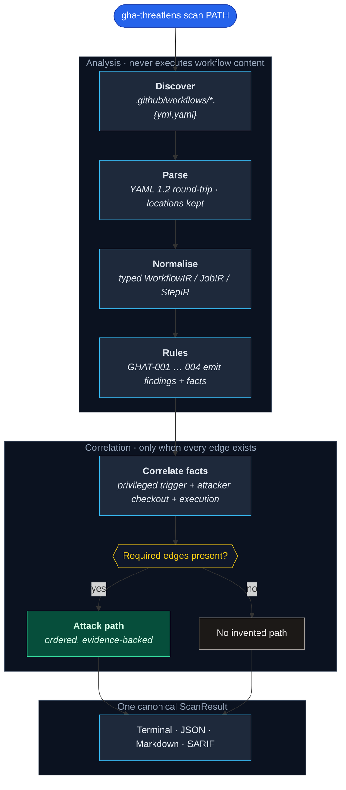

# GHA-ThreatLens

**Offline static analysis and attack-path correlation for GitHub Actions.**

Record atomic facts. Correlate only when the chain is complete. Report evidence, not guesses.

[](CHANGELOG.md)
[](https://github.com/yusufdalbudak/gha-threatlens/actions/workflows/ci.yml)
[](#requirements)
[](LICENSE)
[](#trust-model)

[Quick start](#quick-start) ·
[How it works](#how-it-works) ·
[Rules](#supported-rules) ·
[Trust model](#trust-model) ·
[Verification](#verification) ·
[FAQ](#faq)

---

A GitHub Actions workflow is a programme that can run untrusted input, execute repository or pull-request code, and hold a `GITHUB_TOKEN` with repository privileges. Isolated YAML checks — a dangerous trigger here, a write permission there — miss the path that actually matters.

GHA-ThreatLens is a local, deterministic CLI. It:

1. **Discovers** workflow files under a directory you supply,
2. **parses** them as YAML 1.2 without executing anything,
3. records **atomic security facts**,
4. and **correlates** those facts into an ordered attack path — only when every required edge is present.

If an essential edge is missing, the tool does not invent a complete path. Isolated indicators are not described as confirmed exploitation.

> [!IMPORTANT]
> **Release posture:** `0.1.0` is a local scanner with four rules and one correlated chain (`pull_request_target` → attacker checkout → execution). It does not claim complete GitHub Actions coverage, zero false positives, or production certification. The numeric score is a prioritisation aid, not a probability that an attacker will succeed.

---

## Why GHA-ThreatLens?

| | |
|---|---|
| **Facts, then paths** | Rules emit findings *and* facts. Correlation runs later, and only when the required edges exist. |
| **Fail honest** | Missing `permissions` is unknown, not write. `pull_request_target` alone is not a confirmed vulnerability. |
| **Offline by construction** | Local scans make no network requests, read no GitHub tokens, and collect no telemetry. |
| **Evidence, not slogans** | Every finding and path carries locations, snippets, and a confidence level separate from the score. |
| **CI-ready reports** | Terminal, JSON, Markdown, and SARIF 2.1.0 from one canonical `ScanResult`. |
| **Deterministic** | Same tree, same result. No LLM classification, no remote policy fetch, no mutable rule pack. |

A typical linter might report `pull_request_target`, a pull-request checkout, `contents: write`, and a local script as four unrelated warnings. When that chain is complete, GHA-ThreatLens emits one ordered path:

```text
External pull request
  → privileged pull_request_target workflow
  → attacker-controlled head checkout
  → checked-out code execution
  → contents: write permission
  → repository modification
```

---

## Quick start

**1. Install** from a clone (no GitHub token, no development extras):

```bash
python3 -m venv .venv
.venv/bin/python -m pip install -U pip
.venv/bin/python -m pip install .
```

The console command is `gha-threatlens`.

**2. Scan** a repository root or an example tree:

```bash
gha-threatlens scan tests/fixtures/repositories/safe
gha-threatlens scan examples/vulnerable --format json
gha-threatlens rules list
gha-threatlens explain GHAT-004
```

`PATH` defaults to the current directory.

> [!NOTE]
> Local scanning requires no GitHub token and performs no network requests. Workflow files and evidence remain in the local process.

Contributor editable install (Python 3.11, 3.12, or 3.13):

```bash
python3 -m venv .venv
.venv/bin/python -m pip install -U pip
.venv/bin/python -m pip install -e ".[dev]"
```

Installation from a built wheel:

```bash
python3 -m pip install dist/gha_threatlens-0.1.0-py3-none-any.whl
```

---

## How it works



| Stage | What happens | Boundary |
|---|---|---|
| **Discover** | List workflow files inside the resolved scan root. Skip symlink escapes and files over 1 MiB. | Never leaves the scan root. |
| **Parse** | YAML 1.2 round-trip load with line and column metadata. Treat `on` as a string. | No object construction from tags. No shell evaluation. |
| **Normalise** | Typed IR for triggers, jobs, steps, permissions, and action refs. Preserve `${{ }}` as data. | Unknown state stays unknown. |
| **Rules** | Four explicit rule classes plus YAML metadata. Each returns findings and facts. | No dynamic plugin loader in v0.1.0. |
| **Correlate** | Group facts by `(workflow_path, job_id)`. Emit a path only when the chain is complete. | Missing edges do not become a path. |
| **Report** | Filter by `--min-severity`. Render one `ScanResult`. | JSON / Markdown / SARIF never print progress logs. |

Details: [`docs/architecture.md`](docs/architecture.md).

---

## What you'll get

This workflow is a complete privileged pull-request chain:

```yaml
name: pr-target-chain
on:
  pull_request_target:
permissions:
  contents: write
jobs:
  test:
    runs-on: ubuntu-latest
    steps:
      - uses: actions/checkout@3d3c42e5aac5ba805825da76410c181273ba90b1 # v7.0.1
        with:
          ref: ${{ github.event.pull_request.head.sha }}
      - run: ./scripts/test.sh
```

GHA-ThreatLens reports **GHAT-004** with evidence for the trigger, the head checkout, the local script, and `contents: write`. Correlation produces one attack path. Direct `./scripts/test.sh` execution is high confidence.

The same trigger with a trusted base checkout and no subsequent execution of pull-request code does **not** produce a confirmed GHAT-004 path.

Illustrative trees (assertions live under `tests/fixtures/`):

```text
examples/
├── vulnerable/
│   └── .github/workflows/
│       ├── pr-target.yml      # complete GHAT-004 chain
│       └── issue-echo.yml     # GHAT-003: issue title in run:
└── hardened/
    └── .github/workflows/
        └── ci.yml             # SHA-pinned actions, contents: read
```

```bash
gha-threatlens scan examples/vulnerable --format markdown
gha-threatlens scan examples/hardened --no-color
```

See [`docs/examples.md`](docs/examples.md).

---

## CLI usage

```text
gha-threatlens scan PATH
gha-threatlens rules list
gha-threatlens explain RULE_ID
gha-threatlens version
```

`scan` options:

| Option | Effect |
|---|---|
| `--format terminal\|json\|markdown\|sarif` | Report format. Default: `terminal`. |
| `--output PATH` | Write the report to a file instead of stdout. |
| `--fail-on informational\|low\|medium\|high\|critical` | Exit 1 when a finding or attack path meets the threshold. |
| `--min-severity informational\|low\|medium\|high\|critical` | Omit lower-severity results. |
| `--no-color` | Disable ANSI colour. Also honoured when stdout is not a TTY or `NO_COLOR` is set. |
| `--quiet` | Suppress the terminal summary; findings and paths are still printed. |

Exit codes:

| Code | Meaning |
|:--:|---|
| **0** | Scan completed; nothing met `--fail-on`, or no fail threshold was set. |
| **1** | Scan completed; at least one finding or attack path met `--fail-on`. |
| **2** | User input, target, or parsing prevented a valid requested scan. |
| **3** | Unexpected internal error. |

JSON, Markdown, and SARIF written to stdout contain only the report. A malformed workflow is recorded as a diagnostic; other files in the same scan are still analysed.

The default maximum workflow size is 1 MiB (`DEFAULT_MAX_WORKFLOW_BYTES`). Larger files are skipped with a diagnostic.

---

## Supported rules

| ID | Title | Behaviour in v0.1.0 |
|---|---|---|
| **GHAT-001** | Mutable action reference | Flags remote GitHub Action and reusable-workflow Git refs that are not a full 40-character commit SHA. Local paths are ignored. Docker image tags are not treated as Git refs; digest analysis is not implemented. |
| **GHAT-002** | Excessive token permissions | Flags `write-all` and explicit high-impact write scopes. A missing `permissions` key is unknown, not confirmed write access. |
| **GHAT-003** | Untrusted expression in command interpreter | Flags untrusted `${{ }}` expressions interpolated into `run:`. Values passed only through `env` are not this finding. Moving a value to `env` does not eliminate every injection case. |
| **GHAT-004** | Privileged execution of pull request code | Flags `pull_request_target` only when attacker-controlled checkout **and** subsequent execution are both present. The trigger alone is not a confirmed vulnerability. |

`gha-threatlens explain RULE_ID` prints remediation and references.

Adding a fifth rule: [`docs/rule-authoring.md`](docs/rule-authoring.md).

---

## GitHub Actions integration

Pin third-party actions to verified full commit SHAs. The SHAs below were resolved from the upstream repositories for the tagged releases shown in comments.

```yaml
name: gha-threatlens
on:
  pull_request:
  push:
    branches: [main]
permissions:
  contents: read
jobs:
  scan:
    runs-on: ubuntu-latest
    steps:
      - uses: actions/checkout@3d3c42e5aac5ba805825da76410c181273ba90b1 # v7.0.1
      - uses: actions/setup-python@5fda3b95a4ea91299a34e894583c3862153e4b97 # v7.0.0
        with:
          python-version: "3.13"
      - run: python -m pip install .
      - run: gha-threatlens scan . --fail-on high --no-color
```

GitHub may inject a repository-scoped `GITHUB_TOKEN` into the job. The scanner does not read `GITHUB_TOKEN`, `GH_TOKEN`, or personal access tokens. It does not use that token for analysis.

### SARIF upload

SARIF display in private repositories depends on the GitHub plan and whether code scanning is enabled. Upload is a separate GitHub integration step; it is not performed by the scanner.

```yaml
name: gha-threatlens-sarif
on:
  pull_request:
  push:
    branches: [main]
permissions:
  contents: read
  security-events: write
jobs:
  scan:
    runs-on: ubuntu-latest
    steps:
      - uses: actions/checkout@3d3c42e5aac5ba805825da76410c181273ba90b1 # v7.0.1
      - uses: actions/setup-python@5fda3b95a4ea91299a34e894583c3862153e4b97 # v7.0.0
        with:
          python-version: "3.13"
      - run: python -m pip install .
      - run: gha-threatlens scan . --format sarif --output results.sarif --no-color
      - uses: github/codeql-action/upload-sarif@f3712979fa5f215279b101dd0a2e3bdfb4353324 # v3.37.7
        with:
          sarif_file: results.sarif
```

`security-events: write` is required for the upload action. GHAT-002 reports explicit high-impact write scopes, including `security-events`. That finding flags breadth of token access; it does not prove the job is unnecessary.

---

## Trust model

| Surface | Authority and boundary |
|---|---|
| **Network** | Local scans make no network requests. |
| **Tokens** | The scanner does not read `GITHUB_TOKEN`, `GH_TOKEN`, or personal access tokens. |
| **Execution** | Workflow content is never executed. Shell is never evaluated. `${{ }}` is not expanded. |
| **YAML** | YAML 1.2 round-trip load. No arbitrary object construction from tags. |
| **Discovery** | Confined to the resolved scan root. Symlinks that leave the root are skipped. |
| **Size** | Workflow files larger than 1 MiB are not parsed. Expression extraction is bounded. |
| **Evidence** | Workflow content and evidence do not leave the local process. There is no telemetry. |
| **Remote access** | Remote private-repository access is out of scope for v0.1.0. |

> [!WARNING]
> GHA-ThreatLens does not modify workflows, commit, push, open pull requests, or upload SARIF. Those are separate, operator-controlled steps.

---

## Risk and confidence

The 0–100 score is a **prioritisation score**, not an exploit probability and not CVSS.

| Dimension | Range |
|---|---|
| Exposure | 0–20 |
| Exploitability | 0–30 |
| Privilege | 0–20 |
| Impact | 0–20 |
| Chain evidence | 0–10 |
| Applicable mitigations | 0 to −20 |

Severity bands: 0–19 informational · 20–39 low · 40–59 medium · 60–79 high · 80–100 critical.

Confidence is separate:

| Level | Meaning |
|---|---|
| **HIGH** | Direct parsed structure. |
| **MEDIUM** | One defensible heuristic. |
| **LOW** | Naming-only or incomplete knowledge. |

Non-high results explain the uncertainty. See [`docs/risk-model.md`](docs/risk-model.md).

---

## Known limitations

- Repository, organisation, enterprise, fork, and Dependabot permission defaults are not visible from local YAML. Missing `permissions` stays unknown.
- Docker digest pinning is not analysed.
- Cache-poisoning and artefact-poisoning correlation are not implemented.
- Package manifests are not inspected; `npm test` after an attacker checkout is a heuristic execution sink (medium confidence).
- Organisation-wide scanning, GitHub Apps, OAuth, and automatic remote discovery are out of scope.
- The four rules do not cover every GitHub Actions weakness.
- SARIF output is tested for GitHub-required fields; the tool does not run a full OASIS schema validator.

---

## Requirements

- **Python 3.11, 3.12, or 3.13**
- A readable directory that contains `.github/workflows/` (or an empty / malformed tree you want diagnostics for)

CI exercises those three Python versions on Ubuntu. Runtime dependencies are `click`, `rich`, and `ruamel.yaml`. Rich is used only for optional terminal colour; structured formats do not depend on it for rendering.

---

## Verification

```bash
python3 -m venv .venv
.venv/bin/python -m pip install -U pip
.venv/bin/python -m pip install -e ".[dev]"
.venv/bin/ruff format --check .
.venv/bin/ruff check .
.venv/bin/mypy src/gha_threatlens
.venv/bin/pytest --cov=gha_threatlens --cov-report=term-missing --cov-fail-under=90
.venv/bin/python -m build
.venv/bin/gha-threatlens --help
.venv/bin/gha-threatlens scan tests/fixtures/repositories/safe
```

Coverage gate: 90%. Tests import the installed `gha_threatlens` package, not `src/` via `PYTHONPATH`.

---

## FAQ

<details>
<summary>Do I need a GitHub token?</summary>

No. Local scans require no token, make no network requests, and do not collect telemetry.
</details>

<details>
<summary>Does the scanner execute my workflows?</summary>

No. It never runs steps, never evaluates shell, and never expands `${{ }}`. YAML is loaded as data.
</details>

<details>
<summary>Why isn't a missing <code>permissions</code> key reported as write?</summary>

Organisation and repository defaults are not visible from local YAML. Missing keys stay unknown rather than being treated as confirmed write access.
</details>

<details>
<summary>Why isn't <code>pull_request_target</code> alone a vulnerability?</summary>

The trigger is privileged, but GHAT-004 requires attacker-controlled checkout <em>and</em> subsequent execution. A trusted base checkout with no execution of pull-request code does not produce a confirmed path.
</details>

<details>
<summary>Is the 0–100 score the chance an attacker succeeds?</summary>

No. It ranks which findings to inspect first. Confidence is a separate field.
</details>

<details>
<summary>Will scanning upload anything to GitHub?</summary>

No. SARIF upload is an optional, separate GitHub Action step you add yourself. The scanner only writes a file if you pass <code>--output</code>.
</details>

Further reading: [`docs/architecture.md`](docs/architecture.md) ·
[`docs/threat-model.md`](docs/threat-model.md) ·
[`docs/risk-model.md`](docs/risk-model.md) ·
[`docs/examples.md`](docs/examples.md) ·
[`docs/rule-authoring.md`](docs/rule-authoring.md) ·
[`CONTRIBUTING.md`](CONTRIBUTING.md) ·
[`SECURITY.md`](SECURITY.md) ·
[`CHANGELOG.md`](CHANGELOG.md)

---

**[MIT](LICENSE)** © Yusuf Dalbudak
