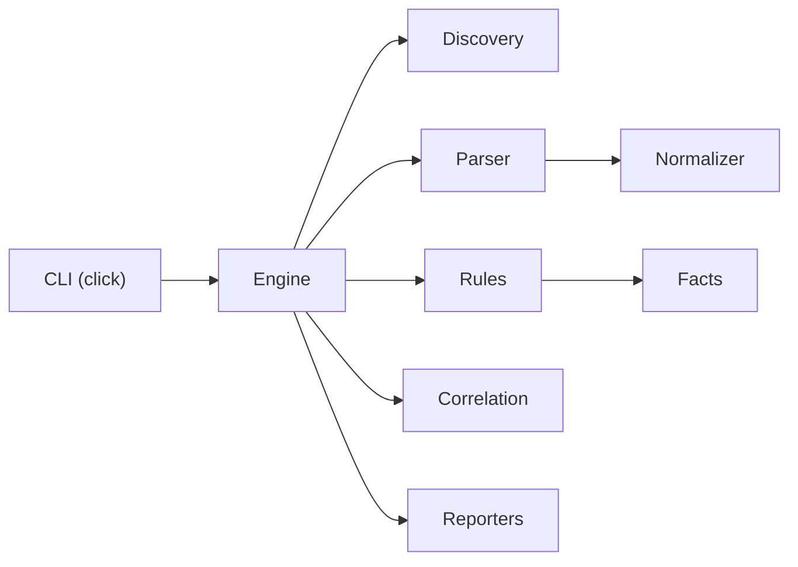

# Architecture

GHA-ThreatLens is a single-process CLI. A scan never starts a server, opens a network socket, or reads GitHub tokens.

## Component boundaries

| Component | Responsibility |
| --- | --- |
| `cli.py` | Argument parsing, colour policy, file output, exit codes. Library functions do not call `sys.exit`. |
| `discovery.py` | Resolve the scan root, list `.github/workflows/*.{yml,yaml}`, skip escapes and oversize files. |
| `parser.py` | YAML 1.2 round-trip load with line and column metadata. |
| `normalizer.py` | Typed `WorkflowIR` / `JobIR` / `StepIR` / `TriggerIR`. |
| `trust.py` | Event and expression trust catalogue. |
| `permissions.py` | `GITHUB_TOKEN` declaration model. |
| `rules/` | Four explicit rule classes plus YAML metadata. |
| `correlation.py` | Pull-request-target chain only, from facts. |
| `scoring.py` | Prioritisation breakdown and severity bands. |
| `reporters/` | Terminal, JSON, Markdown, SARIF from `ScanResult`. |

## Data flow

1. Resolve `PATH` to a directory. Refuse missing paths and non-directories.
2. Discover workflow files under `.github/workflows` inside that root. Do not recurse into nested example trees. Do not follow symlinks that leave the root.
3. Parse each file once. Malformed YAML becomes a diagnostic; remaining files continue.
4. Normalise mappings into the IR. Preserve `${{ }}` as data. Treat the `on` key as a string (YAML 1.2). Warn if the trigger key was parsed as boolean `true`.
5. Evaluate the four rules. Each rule returns findings and facts.
6. Correlate facts into attack paths when every required edge exists.
7. Filter by `--min-severity`. Render one canonical `ScanResult`.

## Domain model

Immutable dataclasses (frozen) for `SourceLocation`, `Evidence`, `PermissionSet`, `ActionRef`, `TriggerIR`, `StepIR`, `JobIR`, `WorkflowIR`, `Finding`, `AttackPath`, `Fact`, `Diagnostic`, and `ScanResult`.

Unknown state is explicit: `PermissionPreset.UNSET`, `PermissionAccess.UNKNOWN`, `TrustLevel.UNKNOWN`, optional fields. Missing `permissions` is never stored as write.

JSON serialisation uses `to_dict()` with stable key order and sorted collections where input order is not semantic. Scan timestamps are UTC; tests inject a clock.

## Parser constraints

- `ruamel.yaml` round-trip (`typ="rt"`), YAML 1.2. This is not `yaml.load` with arbitrary object construction.
- Files larger than 1 MiB are not parsed.
- Expression extraction is a bounded regular expression (`MAX_EXPRESSION_LENGTH`).
- Workflow content is never executed, and shell is never evaluated.

## Rule evaluation

Rules implement `Rule.evaluate(workflow) -> (findings, facts)`. Metadata lives in `src/gha_threatlens/rules/metadata/*.yml` and is loaded once per rule class. The registry in `rules/__init__.py` is an explicit tuple, not a plugin loader.

Correlation does not re-parse YAML. It groups facts by `(workflow_path, job_id)` and requires:

- `privileged_pr_target`
- `attacker_checkout`
- `execution_after_checkout`

Reachable privilege affects scoring and narrative, not whether the path is created once execution exists. Duplicate evidence yields one fingerprint.

## Reporters

All formats consume `ScanResult`. Terminal may use Rich when colour is enabled; `--no-color`, non-TTY stdout, `NO_COLOR`, and non-terminal formats disable colour. JSON, Markdown, and SARIF never print progress logs.

Markdown escapes untrusted evidence. SARIF 2.1.0 uses repository-relative URIs, one-based regions, rule descriptors, and partial fingerprints. Full OASIS schema validation is not performed.

## Error boundaries

Expected failures raise `ThreatLensError` subclasses (`InvalidTargetError`, `YamlParseError`, `UnsupportedStructureError`, and related types). The CLI maps them to exit code 2. Unexpected exceptions become exit code 3 without an uncontrolled traceback in the default path.

A malformed file does not hide findings from other files.

## CLI library choice

Click is used instead of Typer. Click provides command groups, choice validation, and `SystemExit` control without a second wrapper layer. Typer would depend on Click for the same surface.

Rich is a runtime dependency only because the terminal reporter uses it for optional colour. Structured formats do not import Rich for rendering. If Rich is absent, the terminal reporter falls back to plain text.

## Extension points used today

Adding a fifth rule requires: metadata YAML, a `Rule` subclass, a registry entry, fixtures, and tests. There is no dynamic plugin discovery in v0.1.0.
